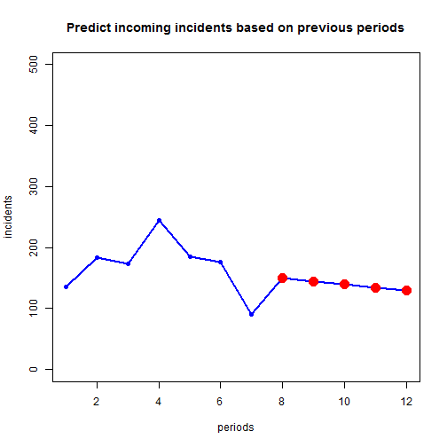

Predict Incoming Incidents
========================================================
author: Adrian Stanciu
date: 06/08/2015

Motivation
========================================================

You have a list of bugs that were open for a period of time, let's say for the past 7 months.
You would like to predict the future: 
* how many bugs will I have next month?
* how many bugs will I have the next 6 months?

Well, no need to look further, this simple program provides you the answer to these questions:


https://astanciu.shinyapps.io/incomingIncidents


Overview
========================================================

The UI is pretty simple. The number of incidents for the previous periods are in the left panel. The number of periods to be predicted can also be adjusted in the left panel.

The method for prediction is very simple in this version: linear method. It would be interesting in a future version to be able to select several types of prediction methods: GLM - Poisson, etc.

Code of server treatment
========================================================


```r
    periods <- c(1, 2, 3, 4, 5, 6, 7)
    # values read from UI in online version
    incidents <- c(135, 184, 173, 244, 185, 176, 90)
    dat <- data.frame(periods,incidents)
    
    # apply linear model
    fit <- lm(incidents ~ periods, data = dat)
    
    # value read from UI in online version
    periodsToPredict <- 5
    lBound <- length(periods) + 1
    uBound <- lBound + periodsToPredict - 1
    new.periods <- c(lBound : uBound)
    
    new.incidents <- predict(fit, newdata = data.frame(periods = new.periods))
```

Results in graphical format
========================================================

 
